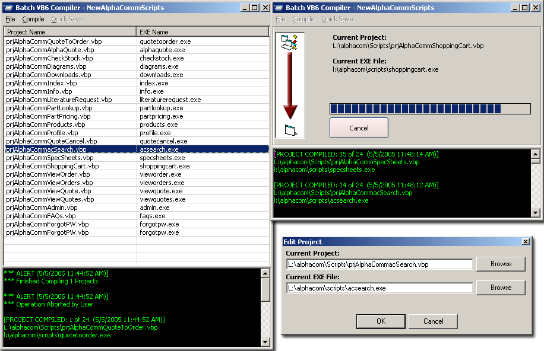



## A1 \- Batch VB Compiler \(Rev\. 2\)

### Description

This is a Batch VB Project Compiler. I found my need for a program like this to grow more and more every day. I am currently contructing and maintaining a website (Currently found: http://www.alpha-comm.com/cgi-bin/index.exe) that consists of 24 Different EXE files. These files all generate page headers and footers that are common amongst all of them. When I make a change in the Header or Footer Module, I want to re-compile ALL of the projects without having to open each one, click "Make xxx.exe", yadda yadda. Features include: Drag_Drop support (drag projects into your project listing, and they are automatically added), List saving (you can have as many different project lists as you want for quick and easy retreival), Log Generating, 'Compile all' or 'Compile Selected Projects' and much more. Please leave me some feedback as this is not the final version (althought it is fully operational), but I would like to know what other VB programmers would need in an application such as this one. Enjoy.
 
### More Info
 

             |
---                |---
**Submitted On**   |2005-05-05 11:58:34
**By**             |[\[\]\)utch\[\]v\[\]aster](https://github.com/Planet-Source-Code/PSCIndex/blob/master/ByAuthor/utch-v-aster.md)
**Level**          |Intermediate
**User Rating**    |3.8 (15 globes from 4 users)
**Compatibility**  |VB 6\.0
**Category**       |[Complete Applications](https://github.com/Planet-Source-Code/PSCIndex/blob/master/ByCategory/complete-applications__1-27.md)
**World**          |[Visual Basic](https://github.com/Planet-Source-Code/PSCIndex/blob/master/ByWorld/visual-basic.md)
**Archive File**   |[A1\_\-\_Batch188480552005\.zip](https://github.com/Planet-Source-Code/utch-v-aster-a1-batch-vb-compiler-rev-2__1-60375/archive/master.zip)

